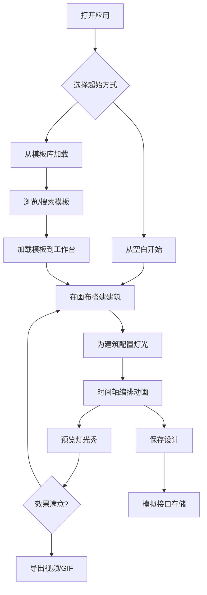

## 1. 产品概述

赛博城市灯光秀设计工具是一款面向创意工作者的纯前端应用，采用未来主义赛博朋克风格，以霓虹粉 + 电光蓝 + 深黑为主色调。用户可以在画布上自由搭建城市建筑轮廓，为每栋建筑配置动态灯光效果，通过时间轴编排完整的灯光秀动画，并最终预览与导出为视频或 GIF。

- 解决创意工作者缺乏直观灯光秀设计工具的问题，降低城市灯光秀的创意设计门槛
- 目标用户为视觉设计师、灯光艺术家、活动策划人员等创意工作者

## 2. 核心功能

### 2.1 用户角色
| 角色 | 注册方式 | 核心权限 |
|------|----------|----------|
| 创意工作者 | 无需注册，本地使用 | 浏览模板、创建/编辑/保存设计、预览与导出 |

### 2.2 功能模块
1. **主工作台页面**：城市建筑编辑画布、灯光属性面板、时间轴编辑器、预览与导出
2. **模板库页面**：预设灯光秀模板浏览、搜索与加载

### 2.3 页面详情
| 页面名称 | 模块名称 | 功能描述 |
|----------|----------|----------|
| 主工作台 | 城市天际线画布 | Canvas 绘制城市建筑轮廓，支持添加/选择/拖拽/缩放/删除建筑，网格对齐辅助 |
| 主工作台 | 建筑属性面板 | 编辑建筑尺寸、位置、类型（写字楼/住宅/塔楼/桥梁），配置窗户灯光密度 |
| 主工作台 | 灯光效果面板 | 选择灯光颜色（霓虹粉/电光蓝/自定义），配置动画类型（呼吸/追逐/闪烁/渐变/彩虹），调节速度/强度/延迟 |
| 主工作台 | 时间轴编辑器 | 多轨道时间轴，拖拽灯光关键帧，调节动画起止时间，播放/暂停/快进控制 |
| 主工作台 | 预览与导出 | 实时 Canvas 预览灯光秀播放效果，导出为 MP4 视频或 GIF 动图 |
| 主工作台 | 工具栏 | 新建/保存/加载设计、切换模板库、撤销/重做、视图缩放 |
| 模板库 | 模板卡片列表 | 预设灯光秀模板展示，含缩略图预览、名称、描述 |
| 模板库 | 模板搜索与筛选 | 按风格/场景关键词搜索筛选模板 |
| 模板库 | 模板加载 | 一键加载模板到主工作台，替换当前设计 |

## 3. 核心流程

用户打开应用后进入主工作台，可以在画布上搭建城市建筑布局，为每栋建筑配置灯光效果。通过底部时间轴编排灯光动画的时序，点击预览按钮实时查看灯光秀效果。满意后可导出为视频或 GIF。用户也可以从模板库加载预设模板快速开始设计。

## 4. 用户界面设计

### 4.1 设计风格
- 主色调：霓虹粉 `#FF2E97`、电光蓝 `#00F0FF`、深黑 `#0A0A14`
- 辅助色：暗紫 `#1A0A2E`、霓虹黄 `#FFE600`、暗灰 `#1E1E2E`
- 按钮：圆角矩形，霓虹发光边框，hover 时发光增强
- 字体：标题使用 Orbitron（科技感），正文使用 Rajdhani（未来感）
- 布局：深色沉浸式布局，左侧工具面板，中央画布，底部时间轴，右侧属性面板
- 图标：Lucide 线性图标，霓虹色描边
- 动效：面板切换滑动、按钮点击脉冲、画布元素选中霓虹发光

### 4.2 页面设计概览
| 页面名称 | 模块名称 | UI 元素 |
|----------|----------|----------|
| 主工作台 | 城市天际线画布 | 深黑背景带微弱网格线，建筑以深灰填充+霓虹描边，选中建筑发光边框，工具栏浮于画布上方 |
| 主工作台 | 建筑属性面板 | 右侧半透明暗色抽屉，Orbitron 小标题，Mantine NumberInput/Select 控件，霓虹色标签 |
| 主工作台 | 灯光效果面板 | 右侧抽屉，ColorPicker 霓虹预设色板，Animation 类型选择卡片，速度/强度 Slider |
| 主工作台 | 时间轴编辑器 | 底部可拉伸面板，多轨道行，彩色关键帧块可拖拽，播放控制条，时间标尺 |
| 主工作台 | 预览与导出 | 居中弹窗模态，Canvas 实时渲染预览，导出格式选择按钮，进度条 |
| 主工作台 | 工具栏 | 顶部固定栏，半透明暗色背景，图标按钮+文字标签，霓虹色活跃状态 |
| 模板库 | 模板卡片列表 | 网格布局卡片，暗色背景+霓虹描边，缩略图+标题+描述，hover 发光效果 |
| 模板库 | 搜索与筛选 | 顶部搜索框+标签筛选器，Mantine TextInput/Pills |

### 4.3 响应式设计
- 桌面优先设计，推荐 1920×1080 及以上分辨率
- 最小支持 1280×720，面板可折叠适配
- 时间轴面板可上下拖拽调整高度

### 4.4 Canvas 场景指导
- 环境：深黑至暗紫渐变夜空，底部微弱城市光晕
- 灯光：建筑窗户随机亮灯，霓虹灯管沿建筑轮廓，整体氛围光
- 相机：固定正交俯视，支持缩放与平移
- 构图：水平天际线构图，建筑高低错落，灯光聚焦中景
- 动画：灯光呼吸/追逐/闪烁/渐变/彩虹，时间轴驱动同步播放
- 后处理：霓虹发光（glow/bloom），色彩溢出，微弱噪点纹理
- 性能：Canvas 2D 渲染，60fps 目标，建筑数 ≤ 50，灯光动画 GPU 友好
