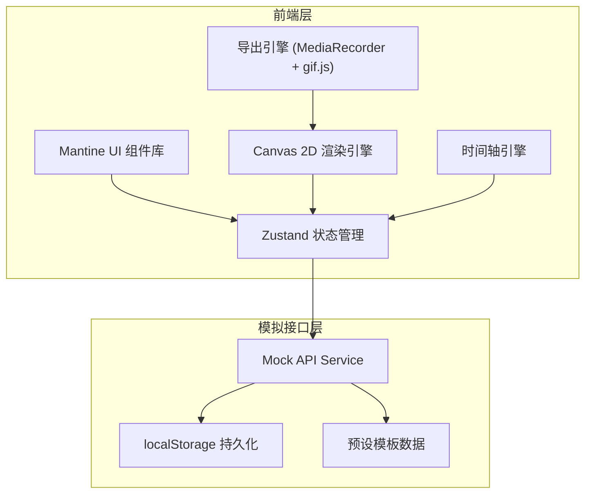

## 1. 架构设计



## 2. 技术说明
- 前端：React@18 + TypeScript + Vite
- UI 框架：Mantine UI@7（组件库 + 主题定制）
- 状态管理：Zustand
- 路由：React Router DOM v6
- Canvas 渲染：原生 Canvas 2D API（requestAnimationFrame 驱动）
- 导出：MediaRecorder API（视频）+ gif.js（GIF）
- 样式：Tailwind CSS + Mantine 样式系统
- 初始化工具：vite-init
- 后端：无（纯前端，模拟 API）
- 数据持久化：localStorage

## 3. 路由定义
| 路由 | 用途 |
|------|------|
| / | 主工作台页面（建筑编辑 + 灯光配置 + 时间轴 + 预览导出） |
| /templates | 模板库页面（浏览/搜索/加载预设模板） |

## 4. API 定义（模拟接口）

### 4.1 模板相关
```typescript
interface LightShowTemplate {
  id: string;
  name: string;
  description: string;
  thumbnail: string;
  tags: string[];
  buildings: Building[];
  lights: LightConfig[];
  timeline: TimelineData;
  createdAt: string;
}

interface TemplateListResponse {
  templates: LightShowTemplate[];
  total: number;
}

// GET /api/templates - 获取模板列表
// GET /api/templates/:id - 获取模板详情
```

### 4.2 设计保存
```typescript
interface UserDesign {
  id: string;
  name: string;
  buildings: Building[];
  lights: LightConfig[];
  timeline: TimelineData;
  updatedAt: string;
  createdAt: string;
}

// POST /api/designs - 保存设计
// GET /api/designs - 获取设计列表
// GET /api/designs/:id - 获取设计详情
// PUT /api/designs/:id - 更新设计
// DELETE /api/designs/:id - 删除设计
```

### 4.3 核心数据类型
```typescript
interface Building {
  id: string;
  type: 'office' | 'residential' | 'tower' | 'bridge';
  x: number;
  y: number;
  width: number;
  height: number;
  windowDensity: number;
  windowPattern: 'grid' | 'random' | 'strip';
}

interface LightConfig {
  id: string;
  buildingId: string;
  color: string;
  animation: 'breathe' | 'chase' | 'blink' | 'gradient' | 'rainbow';
  speed: number;
  intensity: number;
  delay: number;
}

interface TimelineData {
  duration: number;
  tracks: TimelineTrack[];
}

interface TimelineTrack {
  id: string;
  buildingId: string;
  lightId: string;
  keyframes: Keyframe[];
}

interface Keyframe {
  id: string;
  startTime: number;
  endTime: number;
  color: string;
  animation: LightConfig['animation'];
  speed: number;
  intensity: number;
}
```

## 5. 项目目录结构
```
src/
├── components/
│   ├── canvas/           # 画布相关组件
│   │   ├── CityCanvas.tsx
│   │   ├── BuildingRenderer.tsx
│   │   └── LightRenderer.tsx
│   ├── panels/           # 侧边面板
│   │   ├── BuildingPanel.tsx
│   │   ├── LightPanel.tsx
│   │   └── Toolbar.tsx
│   ├── timeline/         # 时间轴组件
│   │   ├── TimelineEditor.tsx
│   │   ├── TrackRow.tsx
│   │   ├── KeyframeBlock.tsx
│   │   └── PlaybackControls.tsx
│   ├── preview/          # 预览与导出
│   │   ├── PreviewModal.tsx
│   │   └── ExportPanel.tsx
│   ├── templates/        # 模板库组件
│   │   ├── TemplateCard.tsx
│   │   ├── TemplateGrid.tsx
│   │   └── TemplateSearch.tsx
│   └── layout/           # 布局组件
│       ├── AppLayout.tsx
│       └── NeonButton.tsx
├── pages/
│   ├── Workbench.tsx     # 主工作台
│   └── Templates.tsx     # 模板库
├── store/
│   ├── useDesignStore.ts # 设计状态
│   ├── useCanvasStore.ts # 画布状态
│   └── useTimelineStore.ts # 时间轴状态
├── hooks/
│   ├── useCanvasRenderer.ts
│   ├── useAnimation.ts
│   └── useExport.ts
├── services/
│   ├── mockApi.ts        # 模拟 API
│   └── storage.ts        # localStorage 封装
├── data/
│   └── presets.ts        # 预设模板数据
├── utils/
│   ├── canvas.ts         # Canvas 工具函数
│   └── colors.ts         # 颜色工具函数
├── types/
│   └── index.ts          # 类型定义
└── theme/
    └── cyberpunk.ts      # Mantine 赛博朋克主题
```
